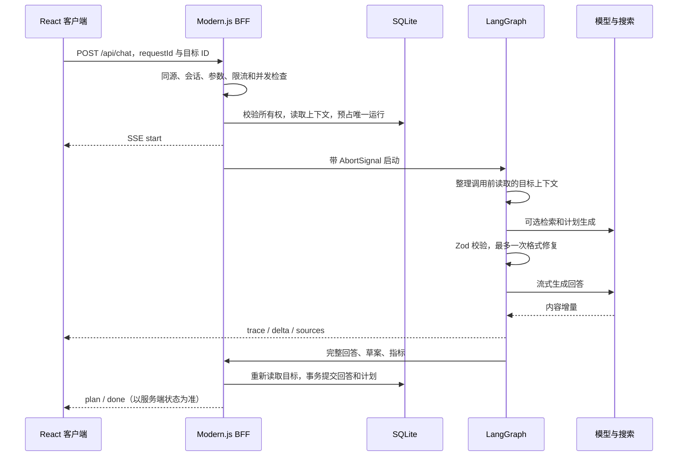

# 架构与取舍

## 一次请求如何完成

## 工作流不是任意自治工具执行器

用户显式选择聊天、制定计划或进度复盘，并决定是否联网。StateGraph 根据状态进入不同分支。检索节点只允许 Tavily 搜索，计划阶段只生成结构化数据；任何生成计划都先以草案保存，用户确认后才改变活动计划。这样可以清楚测试每条分支，也避免模型无约束调用工具。

## 流式协议

统一 SSE 事件：`start`、`trace`、`delta`、`sources`、`plan`、`done`、`error`。心跳使用注释帧。前端必须收到 `done` 才把本轮视为成功，不能把连接关闭当作成功。

- `shared/sse.ts` 保留跨数据块的 UTF-8 和行缓冲，支持 CRLF、多行数据和注释。
- 真实模型适配器只转发 `content`；`reasoning_content` 不进入用户界面。
- 界面中的过程信息来自工作流状态，不是伪造的模型思考。
- 前端用 requestAnimationFrame 合并增量更新；用户滚离底部后不自动抢回滚动位置。
- 取消信号传递到模型 fetch、搜索请求和图执行。失败、取消与超时不保存半截回答。
- 目前没有断点续传。网络失败后刷新查看权威状态，重新发送会生成新的 requestId。

## 数据一致性

`conversations` 保存结构化目标快照，`runs` 保存运行状态，`sessions` 保存匿名会话哈希与过期时间。所有目标读取都带 owner 条件。

同一目标只允许一条 running 记录，由 SQLite 部分唯一索引约束；requestId 主键拒绝重复提交。完成后在单个事务内重新读取目标并追加本轮结果，防止覆盖生成期间其他页面提交的任务记录。

计划更新带版本号。版本不一致时返回 409，前端刷新最新状态；不采用最后写入直接覆盖。确认新草案会归档旧的活动计划。任务完成时间和用户记录是真实提交的数据，模型只能读取，不能改写。

服务启动时把遗留 running 记录标记为 interrupted，因此只能运行一个服务进程。这个恢复策略不适用于多个实例共享同一文件。大量并发或多实例部署时，应改用外部数据库和带租约的运行协调机制。

## 成本与失败边界

单目标最多 100 轮对话；输入最多 4000 字符、请求体最多 20KB，模型上下文最多约 20000 字符的最近消息，单次响应限制 24000 字符。总超时 90 秒，搜索超时 12 秒，最多 4 条检索结果。

聊天与复盘通常一次模型调用；制定计划需要一次结构化生成和一次流式说明，格式修复最多额外一次调用。没有 token 费用估算，因为不同供应商计费和 usage 上报不同；面板展示实际调用次数、字符数和时间。

检索不可用可以降级，但模型不可用不会自动伪装成正常回答。重试策略只用于格式修复，不对已经发出部分内容的模型请求自动重放。

## 参考文档

- [Modern.js 自定义 Web Server](https://modernjs.dev/guides/advanced-features/web-server)
- [LangGraph 工作流](https://docs.langchain.com/oss/javascript/langgraph/workflows-agents)
- [Node.js SQLite](https://nodejs.org/api/sqlite.html)
- [Tavily Search API](https://docs.tavily.com/documentation/api-reference/endpoint/search)

实现以锁文件对应的实际安装版本为准，在线最新文档可能采用不同版本的 API。
